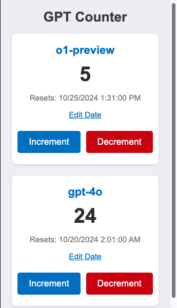
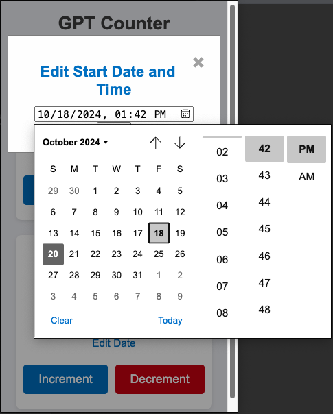

# GPT Counter Chrome Extension

This Chrome extension (works on all chromium browsers) tracks the number of requests made to specific models (`o1-preview` and `gpt-4o`) on `chatgpt.com` and displays the usage count in a popup.

## Features

- Tracks requests to `o1-preview` and `gpt-4o` models.
- Displays request counts for each model.
- Allows manual increment and decrement of counts via popup buttons.
- Provides an option to edit the start date and time for counting.
- Reset dates are displayed for each counter.

## Installation

1. Clone the repository or download the files.
2. Go to `chrome://extensions/` in Google Chrome or `edge://extensions/` for Edge. It should work for all chromium based browers.
3. Enable "Developer mode" in the top right corner.
4. Click on "Load unpacked" and select the folder containing the extension files.

## Usage

1. Click the extension icon to open the popup.
2. View the request counts for `o1-preview` and `gpt-4o`.
3. Use the buttons to increment or decrement counts.
4. Click "Edit Date" to change the start date and time for counting.
5. The counts are saved locally and doesn't currently sync across browsers/computers

Note: The program doesn't know how many requests was made and when it resets initially unless you specify it in the popup. It will start counting after your first request on chatgpt when you install it.

## Screnshots

 

## How It Works

The extension listens for requests to chatgpt.com. When a conversation request matches either the o1-preview or gpt-4o models, it increments the corresponding count. The first request it captures will increment the count to 1 and set start date/time to the current date/time. It is your responsible to make sure this is correct and update it manually if needed. After the initial setup you no longer have to worry about the counter and date unless you use the same account on a different system/browser.

## Permissions

- **Web Request**: To monitor requests to `chatgpt.com`.
- **Storage**: To save request counts, reset times, and counter order.

## Todo

1. Allow counters to be reordered.
2. Allow selection of models
3. Sync count between different browers/systems in realtime

## License

This project is licensed under the MIT License.
